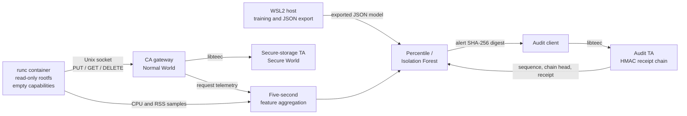
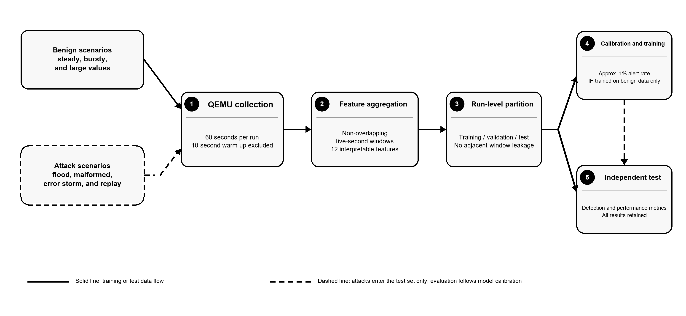

# TEECAM

**Trusted Execution and Edge Container Anomaly Monitor**

> Internal compatibility name: **COTE3-Mon**. Existing executable names,
> Python package names, environment variables and JSON schemas retain the
> historical `cote3`/`cote3mon` names for reproducibility.

[English](#english) · [中文说明](#中文说明)

---

## English

### Overview

TEECAM is a reproducible research prototype for security monitoring in
containerised edge systems. It connects three controls in one experimental
path:

1. a narrow Unix-domain-socket gateway for controlled access to OP-TEE secure
   storage;
2. five-second telemetry windows evaluated by a percentile baseline or an
   Isolation Forest; and
3. an OP-TEE Audit Trusted Application (TA) that issues HMAC-protected receipts
   for submitted alert digests.

The full prototype runs in an OP-TEE 4.10.0 QEMU v8 AArch64 guest with
Buildroot Linux and `runc`; model training and analysis run on a WSL2 Ubuntu
22.04 host. A trained Isolation Forest is exported to JSON and evaluated in
the AArch64 guest by a pure-Python runtime without NumPy or scikit-learn at
inference time.

This repository contains system implementation and reproducibility material.
The dissertation, ethics and administrative documents, bulk raw logs,
generated reports and compiled binaries are intentionally excluded. Compact
machine-readable experiment outputs are retained under [`results/`](results/).

### Architecture



The container does not receive `/dev/tee0` or `/dev/teepriv0`. It reaches the
gateway through `/run/cote3-mon/gateway.sock`; the gateway maps only `PUT`,
`GET` and `DELETE` to the secure-storage TA. Unknown operations, oversized
fields and incomplete messages are rejected before a TEE command is invoked.
The protocol allows keys up to 64 bytes and values up to 4,096 bytes.

### Repository map

| Path | Purpose |
|---|---|
| `src/gateway/` | C gateway, mock backend and OP-TEE/libteec backend |
| `src/client/` | Command-line client and deterministic workload generator |
| `src/common/` | Binary Unix-socket protocol implementation |
| `include/` | Protocol and secure-storage TA interfaces |
| `cote3mon/` | Telemetry, features, training, exported-model runtime, evaluation and monitoring |
| `optee/audit_ta/` | Audit TA source and its Normal-World client |
| `optee/buildroot/` | Buildroot and Linux configuration fragments |
| `container/config.json` | Restricted OCI/`runc` configuration |
| `experiments/` | Fixed experiment manifests |
| `scripts/` | Build, QEMU integration, collection, parity, performance and analysis scripts |
| `tests/` | Python unit tests and C gateway integration tests |
| `results/` | Curated Stage 2–5 features, models, metrics and summaries |
| `versions.lock` | Recorded platform, seed and protocol versions |

### Container controls

The OCI workload container uses a read-only root filesystem, an empty Linux
capability set, `noNewPrivileges: true`, separate PID/IPC/UTS/mount/network
namespaces, a private tmpfs `/dev` without OP-TEE device nodes, and a
bind-mounted gateway socket directory.

The process runs as UID/GID 0 inside the container. Therefore this prototype
must not be described as a non-root container; its restriction comes from the
controls listed above.

### Host build and tests

Run the host-only build and test suite on Ubuntu or WSL2:

```bash
python3 -m venv .venv
source .venv/bin/activate
python3 -m pip install --upgrade pip
python3 -m pip install -e '.[ml,analysis,dev]'

make
make test
sh tests/run_c_integration.sh
```

`make test` runs the Python unit tests. The C integration test starts the mock
gateway, exercises `PUT`, `GET`, `DELETE` and malformed-input rejection, and
checks the generated telemetry.

For a small mock-backend demonstration, start the gateway:

```bash
COTE3_RUN_ID=demo \
COTE3_CONTAINER_ID=demo-client \
COTE3_SCENARIO=steady \
./build/host/cote3-gateway \
  --backend mock \
  --socket /tmp/cote3-gateway.sock \
  --telemetry /tmp/cote3-telemetry.jsonl
```

Then use another terminal:

```bash
./build/host/cote3-client --socket /tmp/cote3-gateway.sock put example value
./build/host/cote3-client --socket /tmp/cote3-gateway.sock get example
./build/host/cote3-client --socket /tmp/cote3-gateway.sock delete example
```

### Full OP-TEE QEMU build

The end-to-end environment is substantially larger than the host-only test.
The scripts target Ubuntu 22.04/WSL2:

```bash
sudo sh scripts/install-optee-prerequisites.sh

sh scripts/bootstrap-optee.sh "$HOME/cote3-optee-qemu-v8"
sh scripts/build-optee-qemu.sh "$HOME/cote3-optee-qemu-v8"
sh scripts/build-qemu-artifacts.sh "$HOME/cote3-optee-qemu-v8"
sh scripts/integrate-qemu-rootfs.sh "$HOME/cote3-optee-qemu-v8"
```

The integration script prints the QEMU launch command. The guest acceptance
script subsequently checks the AArch64 platform, TEE-device isolation, gateway
operations, protocol rejection and Audit TA receipt-chain behaviour:

```bash
/opt/cote3-mon/qemu-guest-acceptance.sh \
  /mnt/host/cote3-bundle \
  /mnt/host/cote3-stage2-results
```

### Synthetic workloads

All workloads are locally generated with fixed seeds. They are controlled
threat mechanisms, not representative production traffic.

| Class | Scenario | Behaviour |
|---|---|---|
| Benign | `steady` | Repeating PUT/GET/GET/DELETE pattern with short pauses |
| Benign | `bursty` | Groups of eight PUT operations followed by an idle period |
| Benign | `large_value` | Repeated 3,072-byte PUT operations |
| Attack | `flood` | Tight-loop 32-byte PUT operations without an intentional delay |
| Attack | `malformed` | Declares an over-limit value and sends an incomplete request |
| Attack | `error_storm` | Repeated GET requests for a non-existent object |
| Attack | `replay` | Repeated PUT of the same key and 128-byte value |

### Features and models

The original model uses 12 window-level features: request rate; PUT, GET and
DELETE ratios; rejection and error ratios; mean and p95 latency; mean and
maximum input size; mean CPU utilisation; and RSS.

Stage 5 adds two repetition features (`key_reuse_ratio` and
`request_reuse_ratio`) and four temporal features
(`operation_transition_ratio`, `idle_mean_us`, `idle_p95_us`, `idle_cv`).

| Feature set | Dimensions | Composition |
|---|---:|---|
| `base12` | 12 | Original Stage 4 features |
| `repetition14` | 14 | Base plus repetition features |
| `temporal16` | 16 | Base plus temporal features |
| `enhanced18` | 18 | Base plus repetition and temporal features |

Raw keys and values are not written to telemetry. The gateway emits
per-process 64-bit equality fingerprints for repetition analysis. These
fingerprints aid feature engineering and data minimisation; they are not an
authentication, encryption or cryptographic privacy mechanism.

The Isolation Forest contains 100 trees. Benign data are split by complete run
into training, validation and test groups; attack runs are test-only. The alert
threshold is calibrated on benign validation scores. A percentile detector is
provided as an interpretable baseline for the original feature set.

### Experimental design



| Stage | Purpose | Design |
|---|---|---|
| Stage 2 | End-to-end acceptance | Container isolation, real CA/TA calls, protocol rejection and audit-chain tamper tests |
| Stage 3 | AI-pipeline smoke test | 7 scenarios × 3 repeats × 15 seconds |
| Stage 4 detection | Formal detector comparison | 7 scenarios × 10 repeats × 60 seconds |
| Stage 4 performance | Relative component overhead | 4 configurations × 10 repeats under the malformed scenario |
| Stage 5 | Feature-set ablation | 70 new QEMU runs; four Isolation Forest feature sets on identical runs and splits |

The performance configurations are gateway only; gateway with telemetry;
telemetry plus Isolation Forest; and telemetry, Isolation Forest plus Audit TA
receipt submission. See [`results/README.md`](results/README.md) for the
curated evidence layout.

### Important limitations

TEECAM is a research prototype, not a production security product.

- The QEMU guest Linux kernel, CA gateway and monitor are inside the current
  trust boundary. A malicious Normal-World kernel or gateway could suppress or
  forge telemetry before an alert is submitted.
- The audit client uses `TEEC_LOGIN_PUBLIC`, and the Audit TA does not
  authenticate caller identity. A receipt proves that a digest was processed
  by the TA; it does not prove that the digest came exclusively from the
  intended monitor.
- Complete alert records remain in the Normal World. Deletion and reordering
  checks depend on a Normal-World verifier, receipt sequence links and the
  current TA chain head.
- The audit chain has no RPMB-level rollback resistance and cannot proactively
  report that a verifier has been disabled.
- Synthetic workloads, a short benign baseline and QEMU/WSL2 scheduling limit
  generalisation. Absolute timing values are not physical-hardware benchmarks.
- The Isolation Forest scores individual windows rather than sequences;
  flooding evaluation is sensitive to partial boundary windows.
- Stage 5 compares feature representations under the same Isolation Forest. It
  is not an enhanced-feature comparison between Isolation Forest and the
  percentile baseline.
- Caller authentication, rate limiting, trusted collection, remote attestation
  and production-hardware validation remain future work.

### Licensing and attribution

Project code is provided under the [MIT License](LICENSE). The secure-storage
interface retains elements from OP-TEE examples; see
[`THIRD_PARTY_NOTICES.md`](THIRD_PARTY_NOTICES.md).

---

## 中文说明

### 项目简介

TEECAM（**Trusted Execution and Edge Container Anomaly Monitor，可信执行与边缘容器异常监控器**）
是一个面向容器化边缘系统的可复现实验原型。源码内部仍沿用 `COTE3-Mon`、
`cote3mon` 等历史名称，以保证原有命令、环境变量、JSON schema 与实验脚本能够继续复现。

系统把三类安全机制连接在同一条实验路径上：

1. 通过 Unix 域套接字网关限制容器能够调用的 OP-TEE 安全存储操作；
2. 将网关请求与进程资源遥测聚合为五秒窗口，并使用百分位基线或 Isolation Forest 检测异常；
3. 将告警摘要提交给 OP-TEE Audit TA，由 TA 返回基于 HMAC 的链式 receipt。

完整原型运行于 OP-TEE 4.10.0 QEMU v8 AArch64/Buildroot 环境，容器运行时为
`runc`；模型训练与分析在 WSL2 Ubuntu 22.04 主机完成。Isolation Forest 被导出为
JSON，并由 QEMU 客体内的纯 Python 运行时推理，客体推理阶段不依赖 NumPy 或
scikit-learn。

本仓库只保存系统实现与复现材料。论文、伦理和行政文件、大体积原始日志、自动生成报告及
编译二进制均被排除；精简的机器可读实验结果保存在 [`results/`](results/) 中。

### 系统工作流程

- 容器只能通过 `/run/cote3-mon/gateway.sock` 调用网关；
- 容器内不暴露 `/dev/tee0` 和 `/dev/teepriv0`；
- 网关只允许 `PUT`、`GET` 和 `DELETE`；
- 网关在调用 TEE 前检查协议版本、操作码、长度与消息完整性；
- 请求日志与 CPU/RSS 数据被聚合为五秒窗口；
- 检测器对窗口评分，超过验证集阈值时生成告警；
- 完整告警保留在 Normal World，仅其 SHA-256 摘要提交给 Audit TA；
- Audit TA 使用受保护的密钥、模型摘要、序号和前一链头生成 receipt。

协议规定 key 最大为 64 字节，value 最大为 4,096 字节。

### 目录说明

| 路径 | 作用 |
|---|---|
| `src/gateway/` | C 语言网关、Mock 后端与 OP-TEE 后端 |
| `src/client/` | 命令行客户端与七类确定性工作负载 |
| `src/common/` | Unix 套接字二进制协议 |
| `include/` | 协议与安全存储 TA 接口 |
| `cote3mon/` | 遥测、特征提取、模型训练、客体推理、评估与监控 |
| `optee/audit_ta/` | Audit TA 与 Normal-World audit client 源码 |
| `optee/buildroot/` | Buildroot 与 Linux 配置片段 |
| `container/config.json` | 受限 OCI/`runc` 容器配置 |
| `experiments/` | 固定实验参数与场景清单 |
| `scripts/` | OP-TEE 构建、QEMU 集成、数据收集、模型一致性与性能分析脚本 |
| `tests/` | Python 单元测试和 C 网关集成测试 |
| `results/` | Stage 2–5 精简特征、模型、指标与摘要 |

### 容器安全配置

容器使用只读 rootfs、空 Linux capability 集合、`noNewPrivileges`、独立的
PID/IPC/UTS/mount/network namespace，以及不包含 OP-TEE 设备节点的私有 `/dev`。

容器进程内部的 UID/GID 是 0，因此不能将其描述为“非 root 容器”。其限制来自
capability、只读文件系统、namespace、设备隔离与 `noNewPrivileges` 等控制。

### 本地构建与测试

建议在 Ubuntu 或 WSL2 中执行：

```bash
python3 -m venv .venv
source .venv/bin/activate
python3 -m pip install --upgrade pip
python3 -m pip install -e '.[ml,analysis,dev]'

make
make test
sh tests/run_c_integration.sh
```

`make test` 执行 Python 单元测试。C 集成测试会启动 Mock 网关，验证
PUT/GET/DELETE、畸形消息拒绝与遥测字段。

完整 OP-TEE QEMU 环境可按英文部分的四个构建脚本依次完成。脚本中的 OP-TEE 根目录均可
通过参数或 `COTE3_OPTEE_ROOT` 环境变量覆盖。

### 七类工作负载

| 类别 | 场景 | 行为 |
|---|---|---|
| 良性 | `steady` | 稳定的 PUT/GET/GET/DELETE 组合 |
| 良性 | `bursty` | 连续八次 PUT 后暂停 |
| 良性 | `large_value` | 重复提交 3,072 字节 value |
| 攻击 | `flood` | 无主动等待的高频 PUT |
| 攻击 | `malformed` | 声明超长 value 并发送不完整消息 |
| 攻击 | `error_storm` | 持续读取不存在的对象 |
| 攻击 | `replay` | 重复提交相同 key 与 value |

这些场景是本地可控的威胁机制，不代表真实生产流量分布。

### 特征与实验阶段

原始模型使用 12 维窗口特征。Stage 5 增加两个重复性特征和四个时序特征，形成
`base12`、`repetition14`、`temporal16` 与 `enhanced18` 四套特征表示。

- Stage 2：验证 AArch64、TEE 设备隔离、真实 CA/TA 调用、协议拒绝与 Audit TA receipt 链；
- Stage 3：七类场景各执行 3 次、每次 15 秒，用于验证 AI 处理流水线；
- Stage 4 检测实验：七类场景各执行 10 次、每次 60 秒；
- Stage 4 性能实验：四种系统配置各执行 10 次，共 40 次相对开销实验；
- Stage 5：重新采集 70 次 QEMU 实验，对 12、14、16 与 18 维四套 Isolation Forest
  特征进行成对消融比较。

Stage 5 比较的是同一 Isolation Forest 下的不同特征表示，而不是 18 维 Isolation
Forest 与 18 维百分位模型之间的算法对比。

### 安全与实验边界

TEECAM 是研究原型，不是可直接部署的生产安全产品。

- QEMU 客体内核、CA 网关和 monitor 当前属于可信边界；
- Audit TA 使用 `TEEC_LOGIN_PUBLIC`，没有验证调用进程身份；
- receipt 只能证明某个摘要由 TA 处理，不能证明提交者一定是合法 monitor；
- 完整告警保存在 Normal World，删除和重排序检查依赖 Normal-World verifier 与 TA 链头；
- 当前审计链不具备 RPMB 级回滚保护，也不能主动报告 verifier 被禁用；
- equality fingerprint 只用于判断同一运行内的重复关系，不提供认证、加密或跨运行隐私保证；
- QEMU、WSL2 调度、合成流量与较短的良性数据限制结果泛化；
- Isolation Forest 独立评分每个窗口，不具备跨窗口序列建模能力；
- 调用者认证、限速、可信采集、远程证明与真实 Arm 硬件验证属于后续工作。

### 许可证与归属

项目代码采用 [MIT License](LICENSE)。安全存储接口保留了 OP-TEE examples 的部分接口定义，
详见 [`THIRD_PARTY_NOTICES.md`](THIRD_PARTY_NOTICES.md)。
